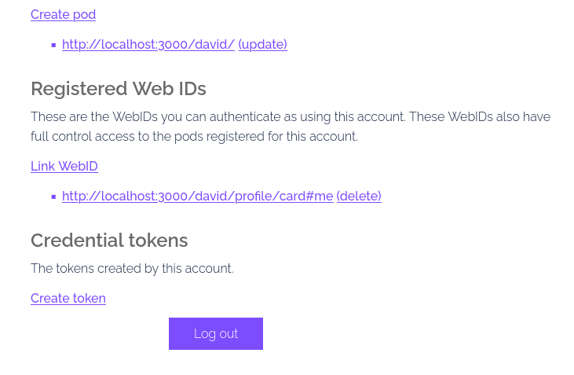

# smag-studio

## solid persistance

- https://communitysolidserver.github.io/CommunitySolidServer/latest/usage/starting-server/
- https://communitysolidserver.github.io/configuration-generator/v7/
- config https://github.com/CommunitySolidServer/CommunitySolidServer/tree/main/config

-> npm install -g @solid/community-server
-> community-solid-server -c @css:config/default.json -f data/

```
# default in memory
npx @solid/community-server
# with config & persistance
community-solid-server -c @css:config/default.json -f data/
# or local install with config
npm install -g @solid/community-server

community-solid-server  -f data/

#community-solid-server -c config/solid_config.json -f data/

with pods
npx @solid/community-server -c @css:config/file.json -f data/
- https://communitysolidserver.github.io/CommunitySolidServer/latest/usage/client-credentials/
create token

```

# GUI for building llm agents

- [ x ] Microsoft Autogen https://microsoft.github.io/autogen/0.2/docs/Examples/ (upload cathy_and_joe_autogen.json)
- [ ] Crewai
- [ ] langgraph
- [ ] MemGPT/ Letta Agents
- [ ] Human Agents
- [ ] Tools Agents (agents with tools)
- [ ] LLM Agents
- [ ] https://github.com/Maximilian-Winter/ToolAgents & https://llama-cpp-agent.readthedocs.io/en/latest/get-started/#llamacpp-server-provider
- Other LLM agents...

## Agents Teams/Crew/Graph

- config
- turn (round robin, hierarchy...)
  ...

## Autogen Agents props

- name
- (description)
- system_message / system prompt
- llm_config
- human_input_mode

* initiate_chat

## Crewai Agents props

### agent

- name
- role
- goal
- backstory

### tools

- name
- description
- code

* crew.kickoff

### task

- description
- expected output
- agent
- output_file

## langgraph Agents props

### global

- state
- flux / workflow
- tools
- agents (nodes) / edges
- should_continue (conditional_edge)
- call_model

* compilation

# vue

This template should help get you started developing with Vue 3 in Vite.

## Recommended IDE Setup

[VSCode](https://code.visualstudio.com/) + [Volar](https://marketplace.visualstudio.com/items?itemName=Vue.volar) (and disable Vetur).

## Customize configuration

See [Vite Configuration Reference](https://vite.dev/config/).

## Project Setup

```sh
npm install
```

### Compile and Hot-Reload for Development

```sh
npm run dev
```

### Compile and Minify for Production

```sh
npm run build
```

### Lint with [ESLint](https://eslint.org/)

```sh
npm run lint
```

# cluster

- https://github.com/vasturiano/d3-force-cluster-3d
- https://github.com/vasturiano/d3-force-3d
- https://github.com/vasturiano/3d-force-graph/issues/298
